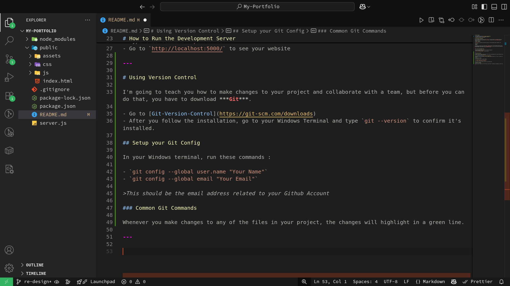
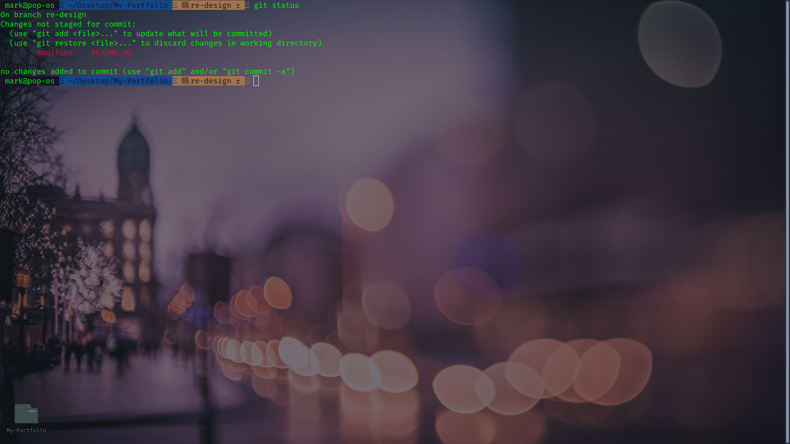
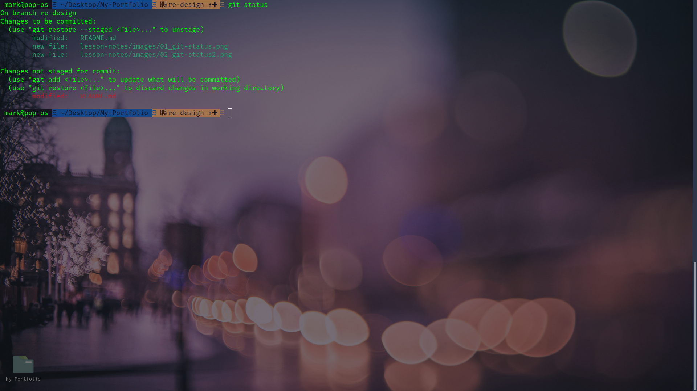
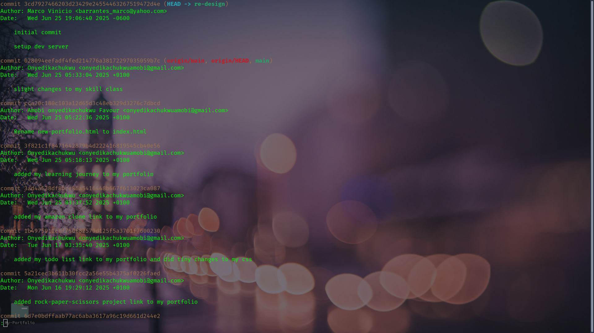

# Install Node-JS

- Go to [Node-JS/Downloads](https://nodejs.org/en/download)
- Chose either `.exe` or `.msi` for Windows installer
- Follow the installation instructions

## Verify Node JS Installation

Go to your Windows Terminal and type `node --version`, this will confirm if it installed correctly by showing the node version. And also type `npm --version` to make sure the ***node package manager*** installed correctly.

### What is Node-JS?

***Node-JS*** is a JavaScript runtime that allows you to create different types of backend's like :

- REST API's
- SOAP
- Graph QL

And several more things like chat applications, video applications, and even Desktop applications using pure JavaScript. We are using it to run a ***development server*** so you can auto refresh the page when you make changes to any of your files in the `public` folder.

>Do not make changes to the `server.js` file, this is your ***Development Server*** so you don't have to depend on Live Server or another VSCode Extension.

---

# How to Run the Development Server

- Open your Windows Terminal where ever you saved this repository
- Type this command `npm run dev`
- Go to `http://localhost:5000/` to see your website

---

# Using Version Control

I'm going to teach you how to make changes to your project and collaborate with a team, but before you can do that, you have to download ***Git***.

- Go to [Git-Version-Control](https://git-scm.com/downloads)
- After you follow the installation, go to your Windows Terminal and type `git --version` to confirm it's installed.

## Setup your Git Config

In your Windows terminal, run these commands : 

- `git config --global user.name "Your Name"`
- `git config --global email "Your Email"`

>This should be the email address related to your Github Account

### Common Git Commands

I'm going to teach you how to use :

- `git status`
- `git add`
- `git restore`
- `git commit`

### Making Changes to your Project

Whenever you make changes to any of the files in your project, the changes will highlight in a green line. Like the image below:

It will look different for you in Windows Terminal, I am using Linux, but it's almost the same thing. When you want to see your changes, type `git status` in the Windows Terminal.

When you're ready to commit a change, type `git add .` If you type `git status` again, it will show you the files that are ready to be committed. Like this : 

Don't worry, if you make a mistake and want to undo it, just type `git restore <name_of_file>`, or if you want to undo everything you did, `git restore .`

### How to check your git commits

You can view all the commits ever made by you or anyone who collaborates with you on any ***git branch***, I'll explain what this means.

Type `git log` and it will shows you all the commits made. Like this:

### Making a commit to your Project

When you are ready to commit all the changes you made, after you have typed `git add .`, you can then type `git commit -m '<title_message>' -m '<description_message>`. You don't always need to have two messages, but is it convention in large teams that you usually have a ***title message*** that explain what the code changes are, and a ***description messaage*** of the changes you made. like ***git commit -m "updated button component" -m "changed the theme color"***

### What is a git branch?

A git branch is a version of the application, website, whatever project you're working on. When you saved your work, it was on the ***main*** branch. I created a branch called ***re-design***

---

# Making a Pull Request

What's a ***pull request***? Well, whenever you make changes on a ***git branch*** and you want to request those changes to be applied to the project, you submit a pull request to your team leader so that they can review it. If they think the changes are good, they will ***merge*** the changes on a specific branch, depending on your team.

If the changes are not okay, they will discuss with you why and what you should be instead, and then you have another chance to try again, make another request and have it reviewed.

---
